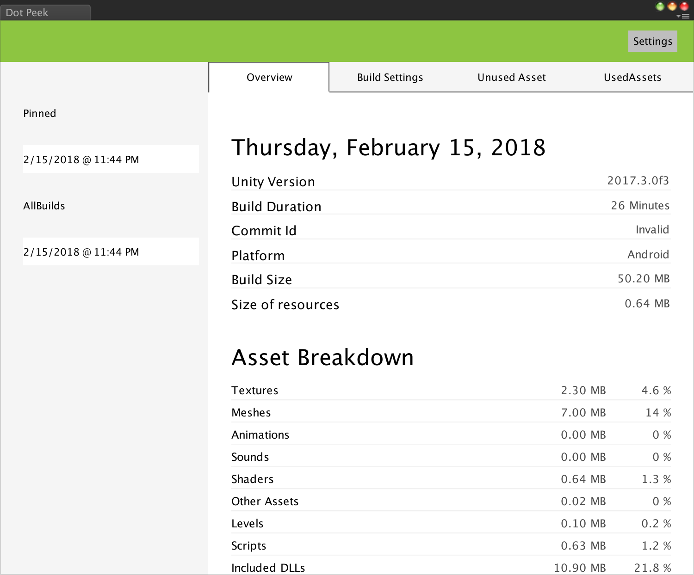

Quick Start
===========

1. After installing .Peek, .Peek window is accessible through the menu ``Window --> DotPeek`` in Unity Editor. Click on it to open .Peek interface.

2. After opening .Peek, open the Setting page.

.. image:: Images/GettingStarted/Settings.png

3. Ensure that ``Generate a Build Report after a build is done`` is enabled. This will indicate to .Peek that a build report should be generated when Unity finishes a build. If you wish that at the end of a build .Peek is automatically opened for you, enable the option ``Automatically open DotPeek after a build is done``.

.. image:: Images/GettingStarted/RightSettings.png

4. Now you are ready to build. Currently .Peek support generating a report for the platforms Windows, Linux, Mac OS, iOS and Android. Build your project for one of these platforms.

5. At the end of the build, if the option is enabled, .Peek should open by itself. If you did not enable it, then open it through ``Window --> DotPeek``.

6. Congratualation ! You generated your first build report ! The left panel of .Peek window contains all the build you generated for your Unity project. Clicking on one of them will open the build report in the right panel.

Next Step
=========

In the coming pages, you’ll learn more about .Peek’s User Interface, and how are stored and managed your build reports.
