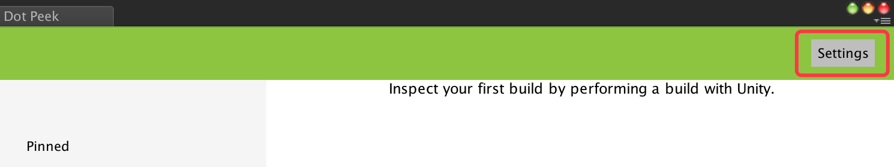
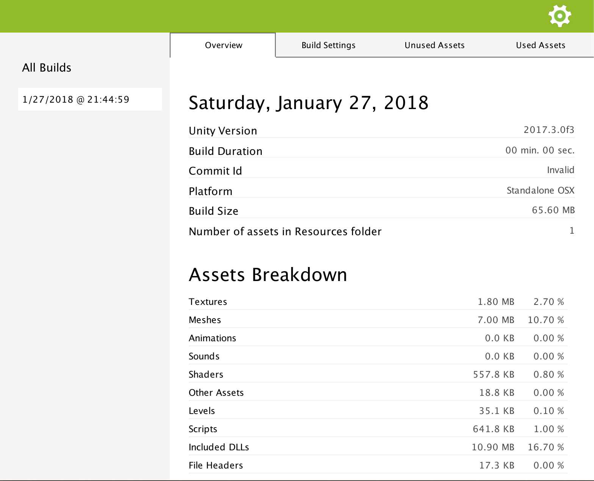

Quick Start
===========

Your first build report
-----------------------

1. After installing .Peek, .Peek window is accessible through the menu **Window** > **DotPeek** in Unity Editor. Click on it 
   to open .Peek interface.

2. After opening .Peek, open the Settings page.

3. Ensure that **Generate a Build Report after a build is done** and **Automatically open DotPeek after a build is done** are 
   enabled.

4. Now you are ready to build. Build your project for one of the supported platforms : Windows, Linux, Mac OS, iOS or Android.

5. At the end of the build, .Peek should open by itself.

6. Congratualation ! You generated your first build report !

Next Step
---------

In the coming pages, you’ll learn more about .Peek’s User Interface, and how your build reports are stored and managed.
