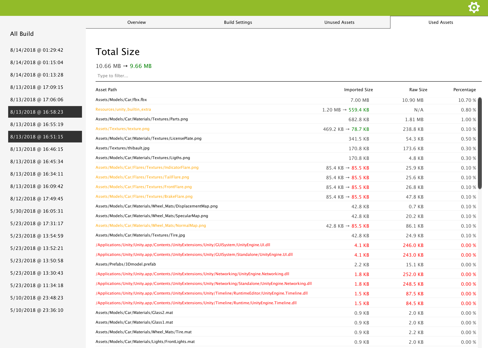

.. _doc_ui-overview_build-report-comparison-assets:

Used/Unused Assets Comparison
=============================

This panel will show you detailed information about which assets were removed, added, or had size change.

* Added assets are green.
* Removed assets are red.
* Modified assets are orange.
* Unmodified assets are black

.. tip::   Assets can be filtered exactly the same way as when you display the information of one build. See :ref:`Used/Unused Assets <doc_ui-overview_build-report-assets>`
           for more details.

Build Impact
------------

When you order assets by imported size or raw size (by clicking on the column header), assets will be ordered based on the size change that occurs. 
If an asset changed from 4 Mo to 7 Mo and another one from 10 Mo to 8 Mo, the latest will be considered smaller than the former 
one since it decreased the size of the build by 2 Mo, whereas the former one increased it by 3 Mo.

State Filtering
---------------

You can display a combination of Added/Removed/Modified/Unmodified assets by entering in the filtering bar : ``state:[combination of 'a', 'r', 'm', 'u']``.

``state:ar`` will only show you added and removed files. ``state:m`` will only show you modified files.

You can combine this filtering with any other filtering explained in :ref:`Used/Unused Assets <doc_ui-overview_build-report-assets>`. For example,
``state:ar t:plugin`` will show you all the removed and added .dll/.so/... in your build. ``state:a t:texture car`` will show you all the textures with
*car* in their path and that are newly added to the build.