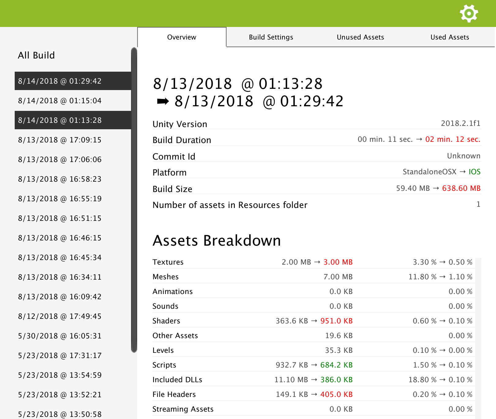

.. _doc_ui-overview_build-report-comparison-overview:

Overview Comparison
===================

*If you want specific information about each field of the Overview panel, please refer to* :ref:`Build Overview <doc_ui-overview_build-report-overview>`.

The overview comparison panel shows you how general information about your build changed. When an information is different, the old one is displayed on the
left side of an arrow, and the new one on the right side. This is a good place to check for example if your build was done with the same version of Unity or not.

If the change has a neutral impact on your build, like a change in the Unity version you are using, it will be displayed in green. If this is a 
change that should draw your attention, it will be displayed in green if this is a positive changed and in red if this is a negative change. 

For example, a size change will be displayed in green if the size decreased, and in red if it increased. Build duration or the number of assets you
have in Resource folders followed the same logic.