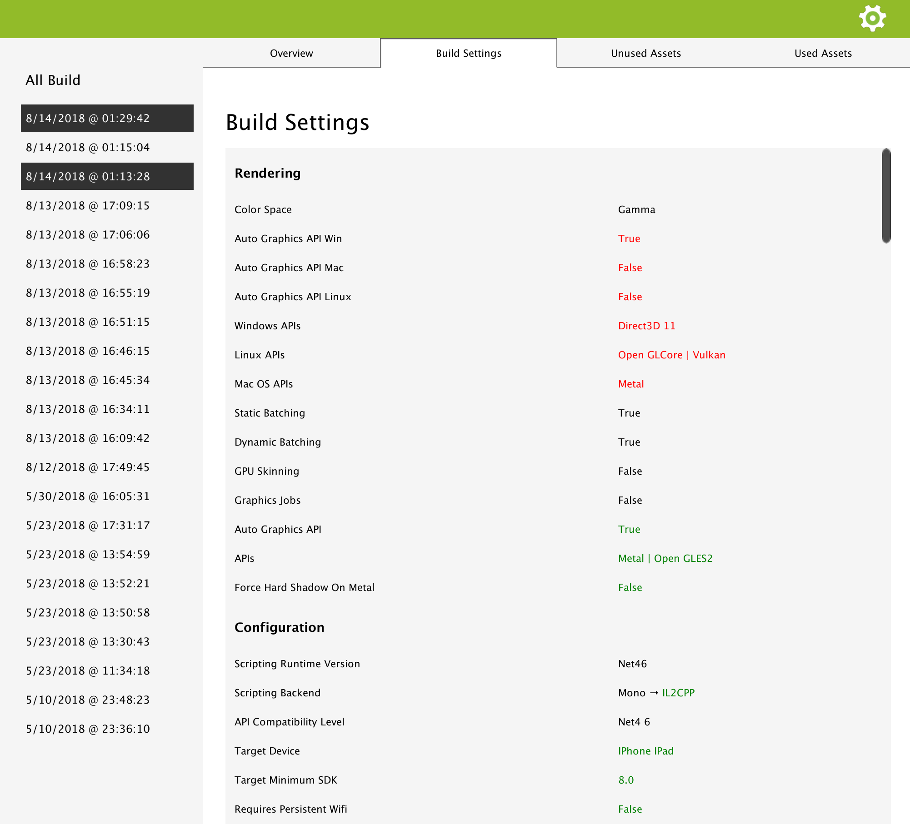
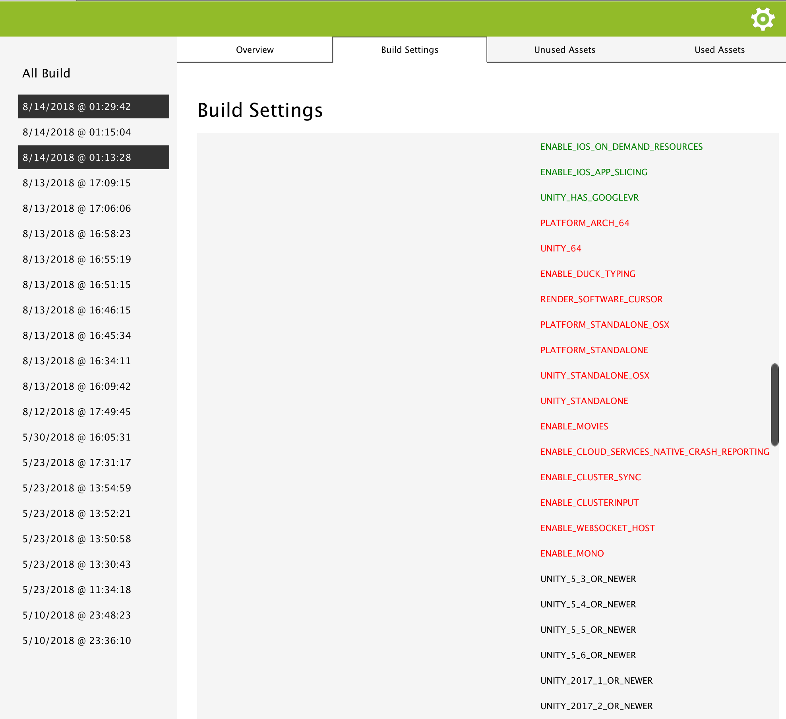

.. _doc_ui-overview_build-report-comparison-settings:

Build Settings Comparison
=========================

Build settings can have an impact on the size of your build or be the source of an issue introduced in your game. By comparing them you can have a 
snapshot of what changed, were added or removed.

* Removed settings : Removed settings are in red. If a compiling directive is removed, then it will be displayed in red.
* Added settings : Added settings are in green. If a compiling directive is added, then it will be in green.
* Modified settings : They are represented with an arrow. Old setting is on the left side of the arrow, new setting is in green on the right side.

