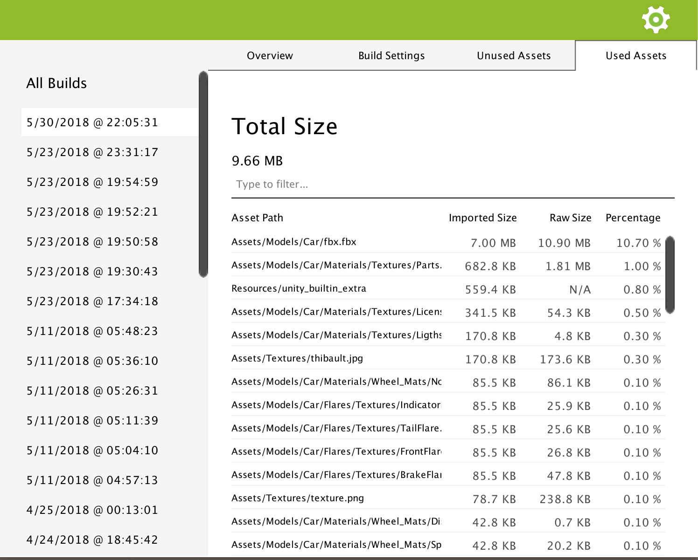

.. _doc_ui-overview_build-report-assets:
 
Used and Unused Assets
======================

These two panels give you a detailed list of the assets included or not in your build. 

The **Total Size** on top of the list is the sum of all the assets *Imported Size*.

Imported Size 
   This is the size of the asset after it was imported in the player. For example, if the asset is a .psd file and is imported under
   the format ETC 4 bits in the player, then Imported Size will display the size of the later. 

Raw Size 
   This is the original size of the asset imported in Unity. This is the size that directly impacts your VCS repository size.

Percentage 
   This is the percentage that represents the *Imported Size* over the total size of the build you can read on the *Overview* panel.