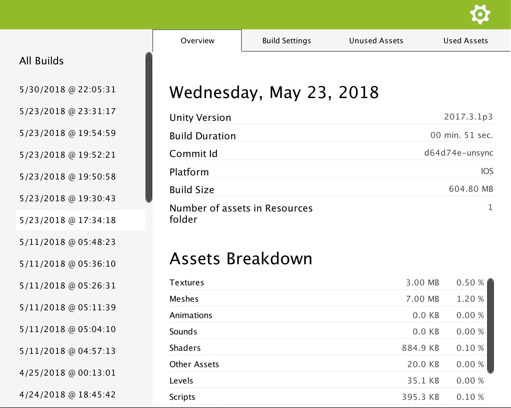

.. _doc_ui-overview_build-report-overview:

Overview
========

The overview page gives you some general information about your build.

Unity Version
   The Unity version used.

Build Duration
   The duration Unity took to make the build.

   .. tip::   Note that .Peek records the time based on callbacks triggered by Unity Editor before and after it produced a build.
              Since several scripts in your project may make use of these callbacks, Unity provides a way to order them. .Peek by default
              will try to receive the prebuild callback as early as possible, and the postbuild callback as late as possible. You can 
              programmatically change these settings, see :ref:`Settings <doc_ui-overview_settings-page>`.

Commit Id
   If your Unity project is linked to a VCS repository, then the commit id at build time will be saved and display here. Note
   that .Peek supports only GIT and SVN at the moment. Windows users may need to ensure these VCS are installed on the command line.

Platform
   The platform the build was done for. For the moment .Peek support generating build reports only for MacOS, Linux, Windows, Android and iOS.

Build Size
   The size of the build before it is packaged to be run on the final platform.

   .. warning::   The size reported here and the final size of your build once it is fully packaged for the final platform can differ a lot. 
                  For example, the size of the final IPA produced for IOS is far different from the sum of the assets copied to the 
                  XCode project before it is compiled.

Size of Resources
   This is the size of the assets added to Resources folders. It is recommended to keep this size low as it directly impacts the startup time
   of your game. You can get more information about this in this `Unity article <https://unity3d.com/fr/learn/tutorials/topics/best-practices/resources-folder>`_.

Assets Breakdown
   This indicates you the size a category of assets occupies in the build.