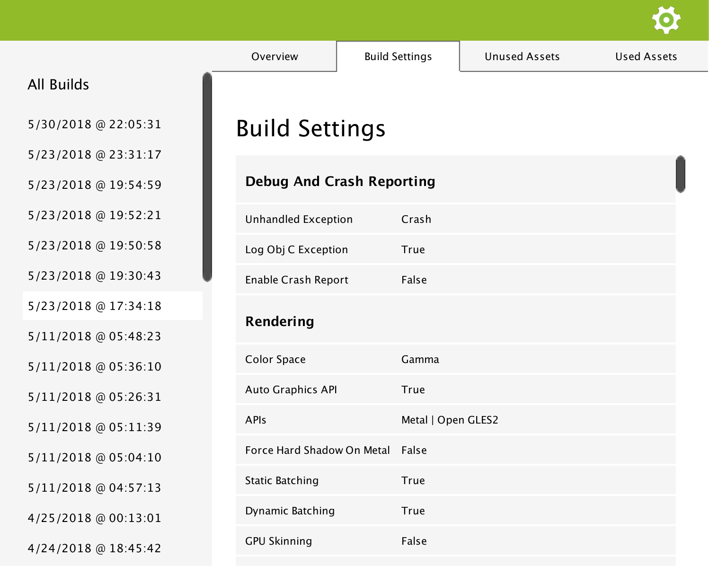

.. _doc_ui-overview_build-report-settings:

Build Settings
==============

The build settings panel shows you which settings were used for the platform you were building for. The settings displayed are relevant to the
platform. So if a setting is specific to Android, like the target API Level, then it won't be displayed if the platform targetted was Standalone.

