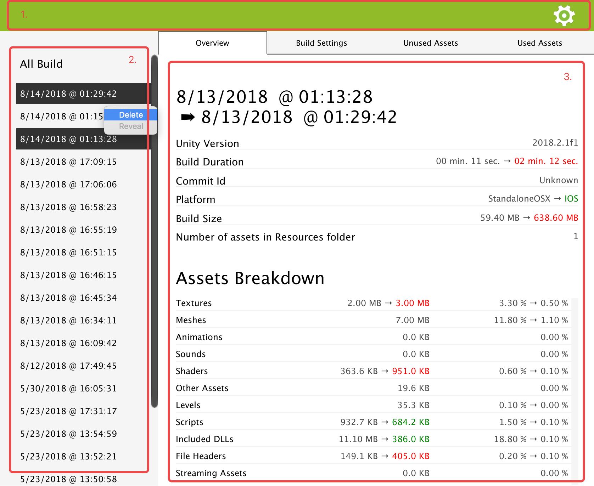

.Peek Front Page
================

This is the first page displayed when you access .Peek through Unity Editor **Window** > **DotPeek**.

It is divided in three parts :

1. The top navigation bar that gives you access to the :ref:`doc_ui-overview_settings-page`.
2. The left panel listing the different build reports based on the time it was generated.
  .. tip:: You can right click on one of them to display a contextual menu. You can either delete it, or reveal the location of the report.
      Clicking on **Ctrl/Command** while right clicking allows you to select several reports for deletion.
3. The central view that displays the build report you selected on the left, or the settings page.

When selecting several build reports on the left panel, .Peek will load a comparison view of the oldest and newest build you selected. This can
allow you to see what changed between two builds and how it impacts the size of each assets.

