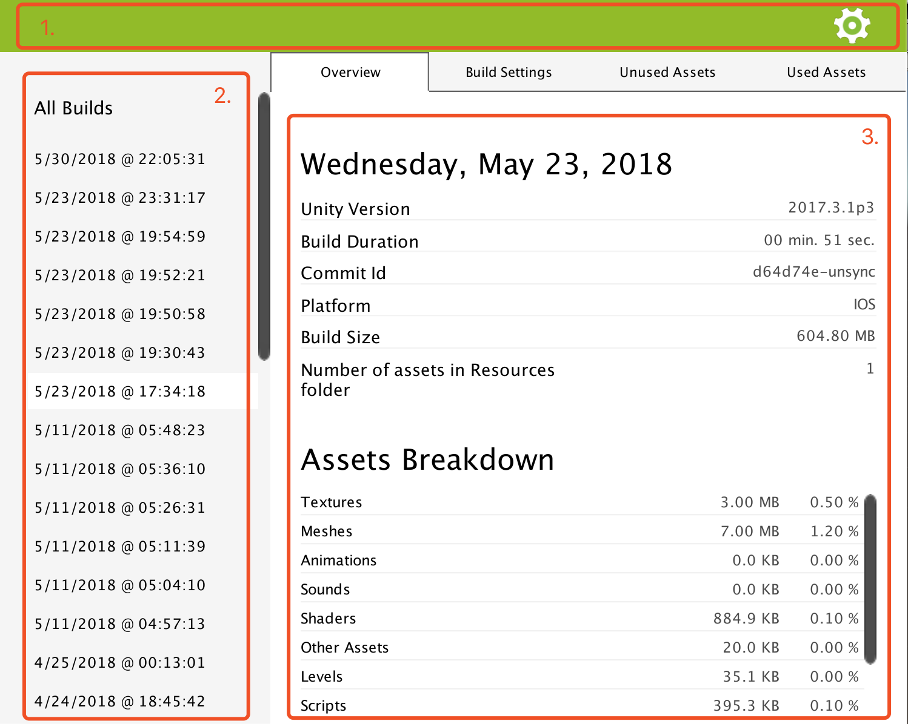

Main Page
=========

This is the first page displayed when you access .Peek through Unity Editor **Window** > **DotPeek**.

It is divided in three parts :

1. The top navigation bar that gives you access to the settings.
2. The left panel listing the different build reports based on the time it was generated.
3. The central view that displays the build report you selected on the left, or the settings page.

