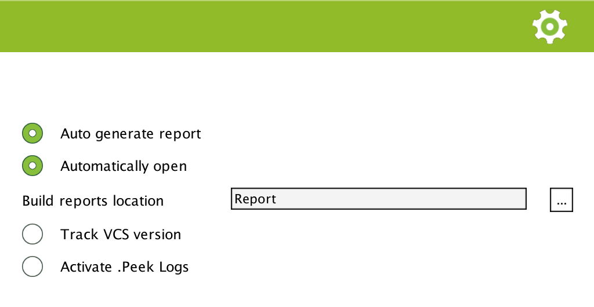

.. _doc_ui-overview_settings-page:

Settings
========

The settings page is accessible from the **Settings** button on the top of .Peek window. Some settings are personal settings,
which means they are saved in the folder *[Unity Project]/.wellfired* which should be ignored from your VCS. Some settings are team shared and are saved in *[Unity Project]/WellFired* which should be added to your VCS 
repository, they are marked with |team|.

.. tip::   Note that these settings can be controlled
           programmatically if you want to enforce .Peek behaviour on different computers (for Continuous Integration for example).

Auto generate report
   If this option is turned on, .Peek will generate a report at the end of a build. You have the possibility to 
   turn off this option and programmatically ask DotPeek to generate a report. This is a personal setting.

Automatically open
   When turned on, .Peek window will automatically open at the end of a build and display the new generated report. 
   This is a personal setting.

Build reports location
   This is the location where reports are saved.

   * Relative paths are team shared |team|. Therefore, if you input *"../BuildReports"* as report location, then all of your 
     team members will have their build reports saved in *[Unity Project]/../BuildReports*. 
   
   * Absolute path are personal, then it will not affect other team members reports location.
     Note that if you indicate a location inside the Unity project, it will be automatically converted to a relative location.

   .. tip:: Different Unity project can save their reports in the same folder. Indeed, .Peek will create a subfolder with 
            the GUID it assigned to your Unity project. The GUID is a team shared setting.

Track VCS version |team|
   If enable and SVN or GIT is installed on your computer, the version of the commit you are building will appear in the report.

   If not all your modification are committed, then *-unsync* will be added to the version (such as : **Commit Id** *4baa424-unsync*).

   Windows users may need to ensure these VCS are installed on the command line. Computers not supporting it will simply display
   **Commit Id** *unknow* no matter this option is enabled or not.

Activate .Peek logs
   This will activate logs when .Peek is running. This will decrease .Peek performances and should be activated only if necessary to debug an issue
   you are meeting with .Peek.

-----

*Team icon on this page is provided for free by* `Icons8 <https://icons8.com/license>`_

